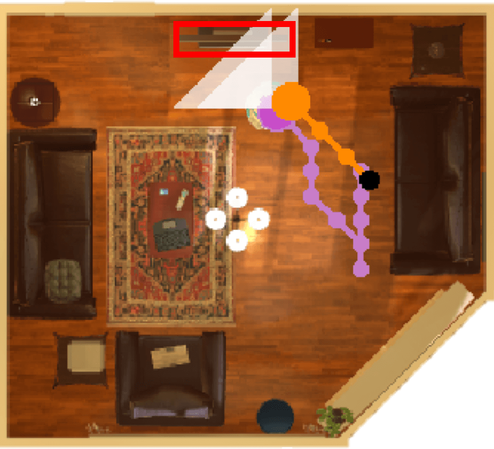
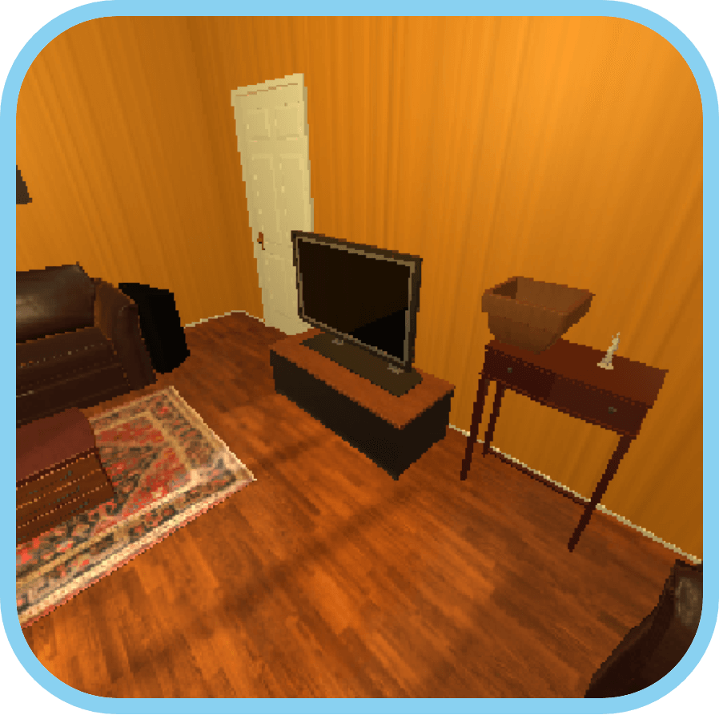
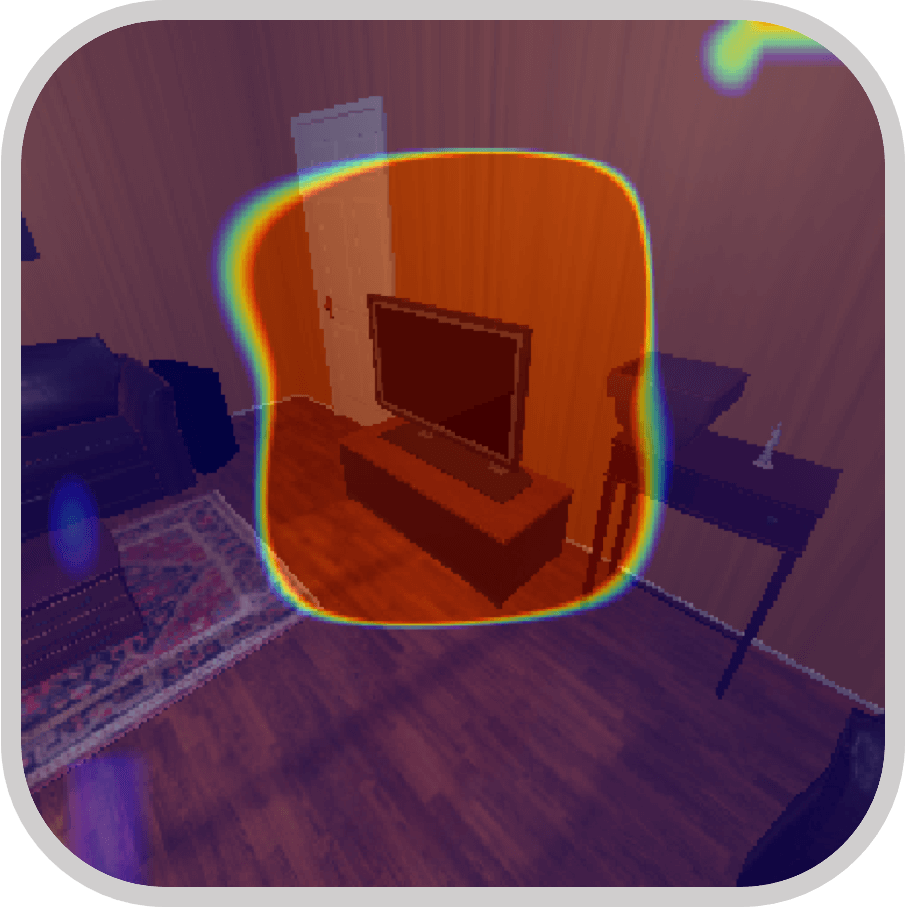

# Visual Navigation with Spatial Attention

By Bar Mayo, Tamir Hazan and Ayellet Tal (CVPR 2021).

[CVPR 2021 Paper ](https://arxiv.org/abs/2104.09807) | [BibTex](#citing)

(a) Paths            | (b) Our's agent view            | (c) Our attention          | (d) [SAVN](https://arxiv.org/abs/1812.00971) agent view
:-------------------------:|:-------------------------:|:-------------------------:|:-------------------------:
  |    |    |  

We present a novel attention probability model for visual navigation tasks. This attention encodes semantic information about observed objects, as well as   spatial information about their place. This combination of the "what" and the "where" allows the agent to navigate toward the sought-after object effectively.
In the figure above (a) The agent aims at finding a TV (red rectangle) in a living room (top view), starting from a given location (black circle). Our agent's path is marked in orange and [SAVN](https://arxiv.org/abs/1812.00971) path is in magenta. At each step, the agent is given a specific view, depending on its position. In this example, our agent starts by turning around in its starting location to gather information---a strategy it has learned. (b) shows our agent's view before the first move forward, whereas (d) shows [SAVN](https://arxiv.org/abs/1812.00971) view before its first move forward.

## Citing

If you find this project useful in your research, please consider citing:

```
@misc{mayo2021visual,
      title={Visual Navigation with Spatial Attention}, 
      author={Bar Mayo and Tamir Hazan and Ayellet Tal},
      year={2021},
      eprint={2104.09807},
      archivePrefix={arXiv},
      primaryClass={cs.CV}
}
```

## Results


| Model  | SPL  &geq; 1 | Success  &geq; 1 | SPL   &geq; 5 | Success  &geq; 5 |
| :-------------: | :-------------: | :-------------: | :-------------: | :-------------: |
| [Our (A2C)](https://??)  |  17.88 | 46.20 | 15.94 | 32.63 |
| [Our (A3C)](https://??)  |  16.99 | 43.20 | 15.51 | 31.71 |
| [SAVN](https://arxiv.org/abs/1812.00971)  |  16.15 | 40.86 | 13.91 | 28.70 |
| [Scene Priors](https://arxiv.org/abs/1810.06543)  | 15.47 | 35.13 | 11.37 | 22.25 |
| [Non-Adaptive A3C](#Non-Adaptvie-A3C)  | 14.68 | 33.04 | 11.69 | 21.44 |


## Setup

- Clone the repository with `git clone https://github.com/barmayo/spatial_attention.git && cd eotp`.

- Install the necessary packages. If you are using conda then simply run 'conda create --name <env> --file requirements.txt`.

- Download the [pretrained models](https://cgm.technion.ac.il/Computer-Graphics-Multimedia/Software/Bar/pretrained_models.tar.gz) and
[data](https://prior-datasets.s3.us-east-2.amazonaws.com/savn/data.tar.gz) to the `eotp` directory. Untar with
```bash
tar -xzf pretrained_models.tar.gz
tar -xzf data.tar.gz
```

The `data` folder contains:

- `thor_offline_data` which is organized into sub-folders, each of which corresponds to a scene in [AI2-THOR](https://ai2thor.allenai.org/). For each room we have  the [ResNet 18](https://arxiv.org/abs/1512.03385) features of all possible locations in addition to a metadata and [NetworkX](https://networkx.github.io/) graph of possible navigations in the scene.
- `thor_glove` which contains the [GloVe](https://nlp.stanford.edu/projects/glove/) embeddings for the navigation targets.

Note that the starting positions and scenes for the test and validation set may be found in `test_val_split`.

If you wish to access the RGB images in addition to the ResNet features, replace `thor_offline_data` with [thor_offlline_data_with_images](https://prior-datasets.s3.us-east-2.amazonaws.com/savn/offline_data_with_images.tar.gz). If you wish to run your model on the image files,
add the command line argument `--images_file_name images.hdf5`. 

## Evaluation using Pretrained Models

Use the following code to run the pretrained models on the test set. Add the argument `--gpu-ids 0 1` to speed up the evaluation by using GPUs.

#### Our (A2C)
```bash
python main.py --eval \
    --test_or_val test \
    --episode_type TestValEpisode \
    --load_model pretrained_models/EOTP_A2C_alpha_SE_66502810_4500000_2020-09-28_09:06:40.dat \
    --model EOTP \
    --results_json eotp_a2c_test.json 

cat eotp_a2c_test.json 
```

#### Our (A3C)
```bash
python main.py --eval \
    --test_or_val test \
    --episode_type TestValEpisode \
    --load_model pretrained_models/EOTP_final_75614446_5000000_2020-10-09_16:54:35.dat \
    --model EOTP \
    --results_json eotp_a3c_test.json 

cat eotp_a3c_test.json 
```

## How to Train your models

You may train your own models by using the commands below.

#### Training
```bash
python main.py \
    --title eotp_train \
    --model EOTP \
    --gpu-ids 0 1 \
    --workers 12
```

## How to Evaluate your Trained Model

You may use the following commands for evaluating models you have trained.

#### Evaluate
```bash
python full_eval.py \
    --title EOTP \
    --model EOTP \
    --results_json eotp_results.json \
    --gpu-ids 0 1
    
cat eotp_results.json
```

## Acknowledgement

In this work we based our code on [SAVN](https://github.com/allenai/savn/) implementation. Please cite the original [SAVN](https://arxiv.org/abs/1812.00971) if you use their part of the code.
